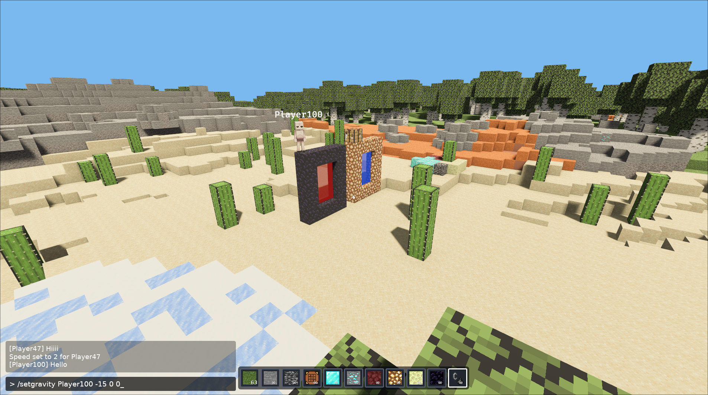

# Modularis

`Modularis` is a multiplayer voxel game built with Rust, Bevy, and
adopting the Patchwork architecture.
Client and server are composed at compile time from small,
replaceable mods.

Check out the AI-generated
<b>[documentation](https://paolobettelini.github.io/modularis)</b>.

<div align="center">
  
</div>

## Build and run

You can either use the [Patchwork desktop application](https://github.com/paolobettelini/patchwork)
or build everything manually.

To compose and build manually, from this repository root:

```sh
patchwork compose \
  --modpack server \
  --modpacks-folder ./modpacks \
  --mods-folder ./mods \
  --cache ./build-server

patchwork compose \
  --modpack client \
  --modpacks-folder ./modpacks \
  --mods-folder ./mods \
  --cache ./build-client
```

Start the server:

```sh
cargo run --manifest-path build-server/server/Cargo.toml
```

Then start one or more clients:

```sh
cargo run --manifest-path build-client/client/Cargo.toml
```

The same client can connect to the alternate scoped parkour server:

```sh
patchwork compose \
  --modpack thecrown \
  --modpacks-folder ./modpacks \
  --mods-folder ./mods \
  --cache ./build-thecrown

cargo run --manifest-path build-thecrown/thecrown/Cargo.toml
```

`thecrown` uses runtime scope nodes to host separate parkour chat groups and a
private transient world for every player.

## Local dependency maintenance

Dependencies between Patchwork mods use sibling paths because Compose and
codegen must inspect their local manifests. Plain Rust helper libraries use the
repository Git URL so an installation that downloads only registry mods can
still compile them through Cargo. Local development patches those Git sources
back to the checkout through `mods/.cargo/config.toml`.

Keep both sides synchronized with:

```sh
mods/.cargo/sync-modularis-deps.sh --dry-run
mods/.cargo/sync-modularis-deps.sh
```

The config is generated and should not be edited manually. The full rationale,
Cargo working-directory behavior, and codegen boundary are documented in
[Cargo dependency sources](documentation/src/architecture/dependency-sources.md).

## Assets

Some textures and character assets used in this project are taken from or based on the following freely licensed asset packs:

* [16x16 Block Texture Set](https://opengameart.org/content/16x16-block-texture-set) — **CC0 1.0**
* [16x16 Block Textures](https://opengameart.org/content/1616-block-textures) — **CC0 1.0**
* [Assorted Minecraft Style Textures](https://opengameart.org/content/assorted-minecraft-style-textures) by JoeEnderman — **CC0 1.0**
* [Open Assets Lib](https://modrinth.com/resourcepack/nightml-open-assets-lib) by NightML / NightMareLore — **CC BY 4.0**
* [Good Vibes](https://github.com/Phyronnaz/VoxelAssets/tree/master/GoodVibes) by Acaitart — **CC BY 4.0**
* [Pixel Perfection Fidelity](https://modrinth.com/resourcepack/pixel-perfection-fidelity) by SourAlien, based on Pixel Perfection by XSSheep — **CC BY 4.0 / CC BY-SA 4.0 upstream**
* [Colorful Kobolds](https://www.curseforge.com/hytale/mods/pastels-kobold) by PastelPaints and KukeiTheProtogen — **Creative Commons 4.0**, as listed on CurseForge

Some of these assets may have been modified, renamed, or adapted for use in this project.

CC0 assets are provided under the [Creative Commons CC0 1.0 Universal](https://creativecommons.org/publicdomain/zero/1.0/) dedication.

Open Assets Lib and Good Vibes are used under the [Creative Commons Attribution 4.0 International (CC BY 4.0)](https://creativecommons.org/licenses/by/4.0/) license. Their original authors are credited above.

Pixel Perfection Fidelity is listed on Modrinth as CC BY 4.0. The project states that many of its textures are derived from XSSheep's Pixel Perfection, which is licensed under CC BY-SA 4.0. Pixel Perfection-derived assets used by this project are therefore attributed to XSSheep and treated under the applicable CC BY-SA 4.0 terms.

Colorful Kobolds is listed by CurseForge under a Creative Commons 4.0 license. The project authors explicitly allow sharing, modification, reuploading, creation of assets/cosmetic packs, and derivative/offshoot projects. Assets credited by Colorful Kobolds to third-party projects are not used unless their respective licenses also permit such use.
